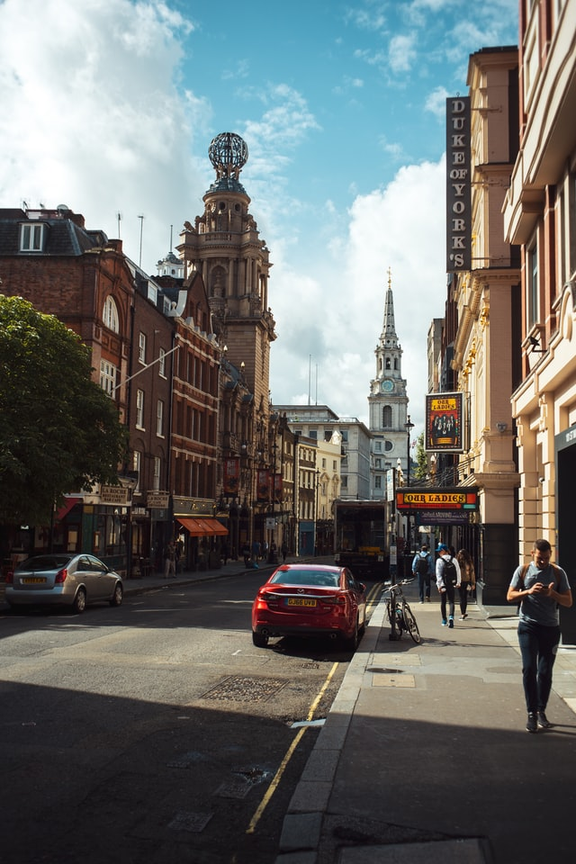
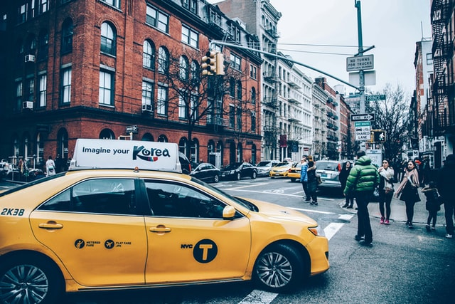
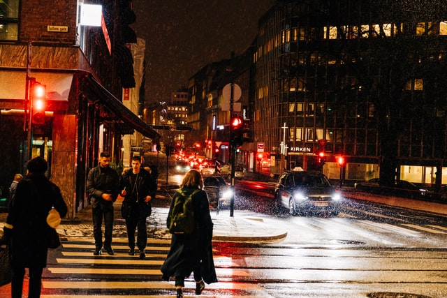
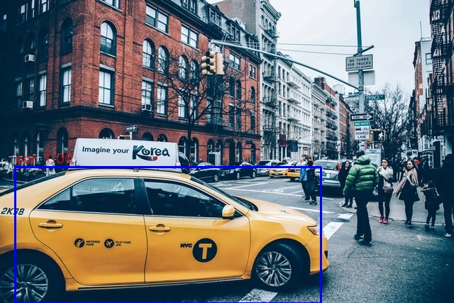
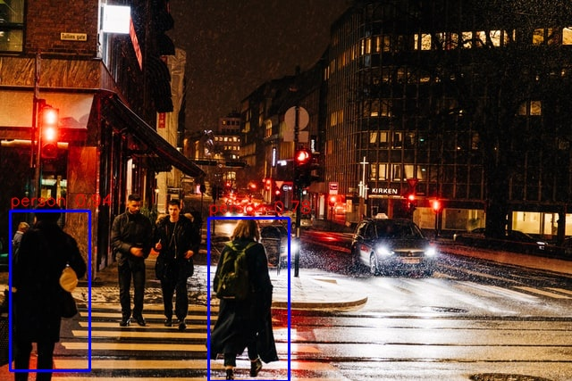

# Using YOLO (You Only Look Once) object detection algorithm to detect persons and cars

   
 
<h6 align="center">Person and cars <a href="https://unsplash.com/photos/AvHBdfZ0HAQ">Vereinigtes Königreich</a>, <a href="https://unsplash.com/photos/X-vNntrloZk">Anthony Delanoix</a> and <a href="https://unsplash.com/photos/2j1SsDAh9_k">Steve Long</a>.</h6>

 

## Overview

YOLO can view an image and draw bounding over what it perceives as identified classes. We apply a single neural network to the full image. This network divedes the image into regions and predicts bounding boxes and probabilities for each region. These bounding boxes are weighted by the predicted probabilities. For more information about this algorithm, please, [click here](https://arxiv.org/abs/1804.02767).

Source code: https://github.com/xiaochus/YOLOv3.

## Experiment and Result

   
 
<h6 align="center">Result of Persons and cars <a href="https://unsplash.com/photos/AvHBdfZ0HAQ">Vereinigtes Königreich</a>, <a href="https://unsplash.com/photos/X-vNntrloZk">Anthony Delanoix</a> and <a href="https://unsplash.com/photos/2j1SsDAh9_k">Steve Long</a>.</h6>

#

<b>Sincerely:</b> <a href="https://github.com/neemiasbsilva">Neemias B. da Silva</a>

#